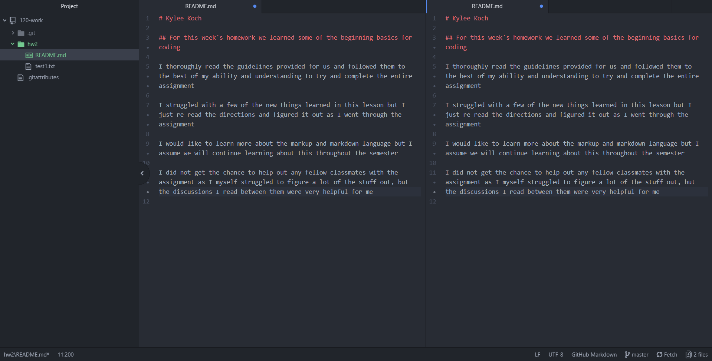

# Kylee Koch

## For this week's homework we learned some of the beginning basics for coding

I thoroughly read the guidelines provided for us and followed them to the best of my ability and understanding to try and complete the entire assignment

I struggled with a few of the new things learned in this lesson but I just re-read the directions and figured it out as I went through the assignment

I would like to learn more about the markup and markdown language but I assume we will continue learning about this throughout the semester

I did not get the chance to help out any fellow classmates with the assignment as I myself struggled to figure a lot of the stuff out, but the discussions I read between them were very helpful for me

